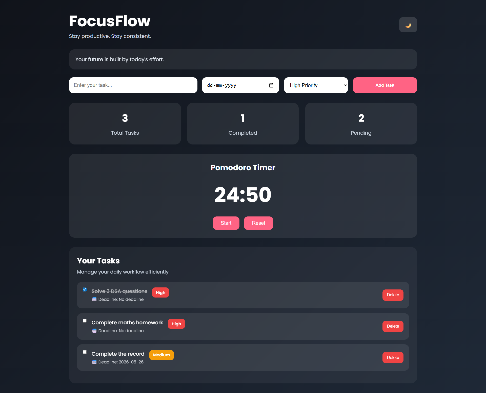

# FocusFlow 🚀

FocusFlow is a modern and responsive student productivity dashboard developed using HTML, CSS, and JavaScript.  
The application helps students efficiently manage tasks, track deadlines, and improve productivity through a clean and interactive user interface.

## ✨ Features

- Task management system
- Deadline tracking with calendar integration
- Dark and light mode support
- Pomodoro productivity timer
- Priority-based task organization
- Local storage support
- Responsive dashboard design
- Motivational productivity quotes

## 🛠️ Tech Stack

- HTML5
- CSS3
- JavaScript
- Local Storage API

## 📸 Project Preview

## 🚀 Live Demo

https://jayasivapriya.github.io/FocusFlow/

## 📂 Project Structure
FocusFlow/
│
├── index.html
├── style.css
├── script.js
├── screenshot.png
└── README.md

## 🔮 Future Enhancements

-Task analytics dashboard
-Pie chart visualization
-Calendar dashboard view
-Drag-and-drop task management
-User authentication system
-Cloud database integration
